# Spine animation

_Spine_ is a third party animation tool by Esoteric Software. Spine animation provides 2D _skeletal animation_ support (see http://en.wikipedia.org/wiki/Skeletal_animation). This is a fundamentally different technique from [flipbook animations](/manuals/flipbook-animation) that is closer to cutout animation. In cutout animation separate pieces of the animated object (e.g body parts, eyes, mouth etc) are moved individually between each frame. Spine animation let you build an invisible, virtual skeleton consisting of a hierarchy of interconnected _bones_. This skeleton, or _rig_, is then animated and individual images are attached to the bones. Defold supports animations created or exported in the [Spine JSON format](http://esotericsoftware.com/spine-json-format). Skeletal animation is very smooth since the engine can interpolate the location of each bone for each frame. It is particularly useful to animate characters and animals, but works very well for other types of objects, like ropes, vehicles or foliage.

  {.inline}
  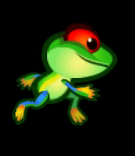{.inline}


## Requirements

### Installation
To use this library in your Defold project, add the needed version URL to your game.project dependencies from [Releases](https://github.com/defold/extension-spine/releases):


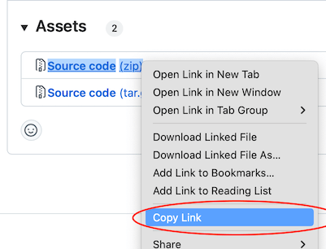{.inline}


## Migration guide

Spine animations used to be part of the main Defold engine. Starting with Defold version 1.2.193 Spine animations have been moved from the engine into a Defold extension. To upgrade to the new version you need to make a few changes to your project. 

### Spine content

* The new file suffix is `.spinejson`
    - Set this as the output suffix in the Spine Editor

* Update the spine source files to latest version
    - The new runtime is based on Spine 4.1.xx

    - NOTE: The old spine version json files won't work as they are too old!

* Update the `.spinescene` files in the project replacing the `.json` reference to the corresponding `.spinejson` file

    * Either manually update your `.spinescene` files in the editor

    * Use search-and-replace in a text editor

    * Use this [python3 script](./defold-spine/misc/migrate.py) to update do the search and replace for you. The script only replaces
    the suffix from `.json` to `.spinejson`:

        `<project root>: python3 ./defold-spine/misc/migrate.py`

    * TIP: It's easiest if the new files has the same name and casing as the old files!

* Update any materials if you've made your custom spine materials

    * The materials + shaders now live in the `extension-spine`

    * The material now uses the `world_view_proj` matrix for transforming the vertices

### GameObject

* `spine.set_skin(url, name)` now takes one argument, the name of the skin

    - The new `spine.set_attachment(url, slot, attachment)` allows you to set an attachment to a slot

* `spine.play_anim()` etc are now synchronous.

* If a callback is set to `spine.play_anim()` it will now receive _all_ spine events (e.g. foot steps etc)


### GUI

* The Lua callbacks have a new signature, to make them more consistent with the game object callbacks

```lua
local function spine_callback(self, node, event, data)
    pprint("SPINE CALLBACK", node, event, data)
end
```

* Currently the play anim requires a callback (i.e. the default handler is currently disabled)


## Concepts

*Spine JSON data file*
: This data file contains the skeleton, all the image slot names, skins and the actual animation data. No images are embedded in this file though. Create this file from your animation software of choice.

*Spine scene*
: The Defold resource tying together the Spine JSON data file and the Defold image atlas file that is used to fill bone slots with graphics.

*Spine model*
: The _SpineModel_ component is put in a game object to bring the graphics and animation to the screen. The component contains the skeleton game object hierarchy, which animation to play, what skin to use and it also specifies the material used for rendering the model.

*Spine Node*
: If using Spine animation in a GUI scene, use Spine GUI nodes instead of Spine model components. See the [GUI documentation below](#gui-spine) to learn more.


## Animation tools

The Spine JSON data format that Defold supports can be created by Esoteric Software's _Spine_ software. In addition, _Dragon Bones_ has the ability to export Spine JSON data files.

_Spine_ is available from [Esoteric Software](http://esotericsoftware.com).

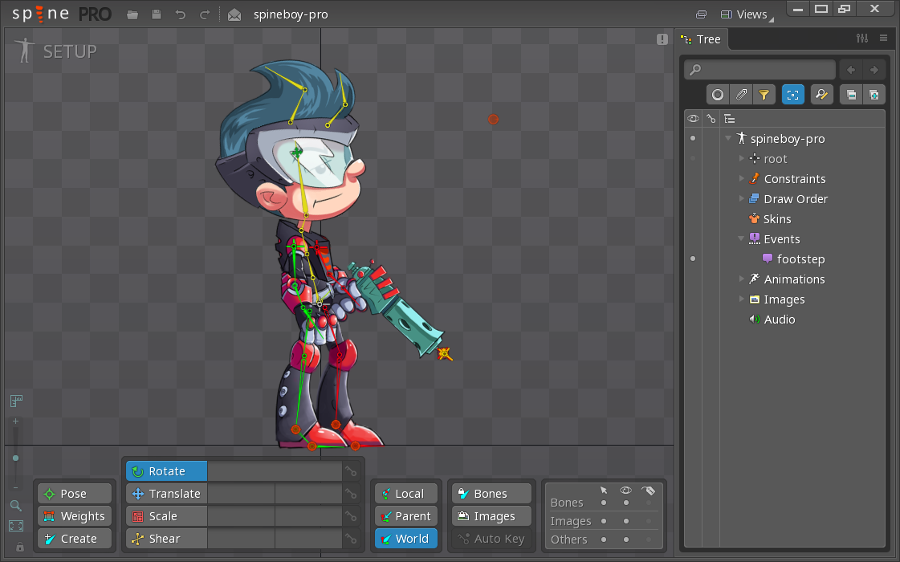

_Dragon Bones_ is available from http://dragonbones.com


::: important
_Dragon Bones_ should typically be able to export to Spine JSON data files without any problems. If your _Dragon Bones_ exported data file isn't rendered properly in Defold we recommend that you use the official [Spine Skeleton Viewer](http://esotericsoftware.com/spine-skeleton-viewer) to first verify that the data can be correctly parsed. If there is a problem with the exported data the Spine Skeleton Viewer can pinpoint problems in the JSON data file, for instance missing or incorrect fields.
:::


## Importing a Spine character and animations

When you have a model and animations that you have created in Spine, the process of importing them into Defold is straightforward:

- Export a Spine JSON version of the animation data. Make sure the extension is `.spinejson`.
- Put the exported JSON file somewhere in your project hierarchy.
- Put all images associated with the model somewhere in your project hierarchy.
- Create an _Atlas_ file and add all the images to it. (See [2D graphics documentation](/manuals/2dgraphics) for details on how to create an atlas and below for some caveats)

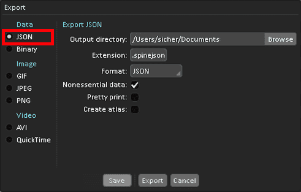

If you work in _Dragon Bones_, simply select *Spine* as your output data type. Also select *Images* as image type. This will export a ∫ file and all necessary images into a folder. Make sure to rename the `.json` file to `.spinejson`. Then add those to Defold as described above.


When you have the animation data and image files imported and set up in Defold, you need to create a _Spine scene_ resource file:

- Create a new _Spine scene_ resource file (Select <kbd>New ▸ Spine Scene File</kbd> from the main menu)
- The new file opens in the spine scene editor.
- Set the *Properties*.

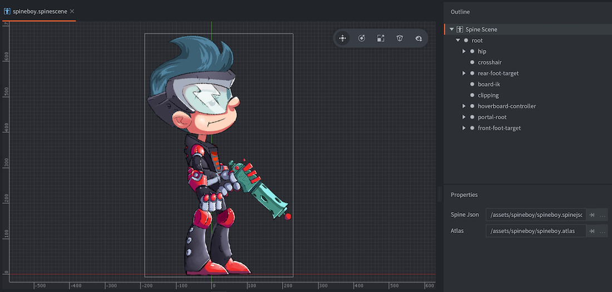

Spine Json
: The Spine JSON file to use as source for bone and animation data (Note: the file must have extension `.spinejson`).

Atlas
: The atlas containing images named corresponding to the Spine data file.


## Project configuration

The *game.project* file has a few [project settings](/manuals/project-settings#spine) related to spine models.


## Creating Spine model components

Select a game object to hold the new component:

Either create the component in-place (<kbd>right click</kbd> the game object and select <kbd>Add Component ▸ Spine Model</kbd>)

Or create it on file first (<kbd>right click</kbd> a location in the *Assets* browser, then select <kbd>New... ▸ Spine Model</kbd> from the context menu), then add the file to the game object by <kbd>right clicking</kbd> the game object and selecting <kbd>Add Component File</kbd>).


### Spine model properties

Apart from the properties *Id*, *Position* and *Rotation* the following component specific properties exist:

*Spine scene*
: Set this to the Spine scene file you created earlier.

*Blend Mode*
: If you want a blend mode other than the default `Alpha`, change this property.

*Material*
: If you need to render the model with a custom material, change this property.

*Default animation*
: Set this to the animation you want the model to start with.

*Skin*
: If your model has skins, select the one you want it to start with.

You should now be able to view your Spine model in the editor:

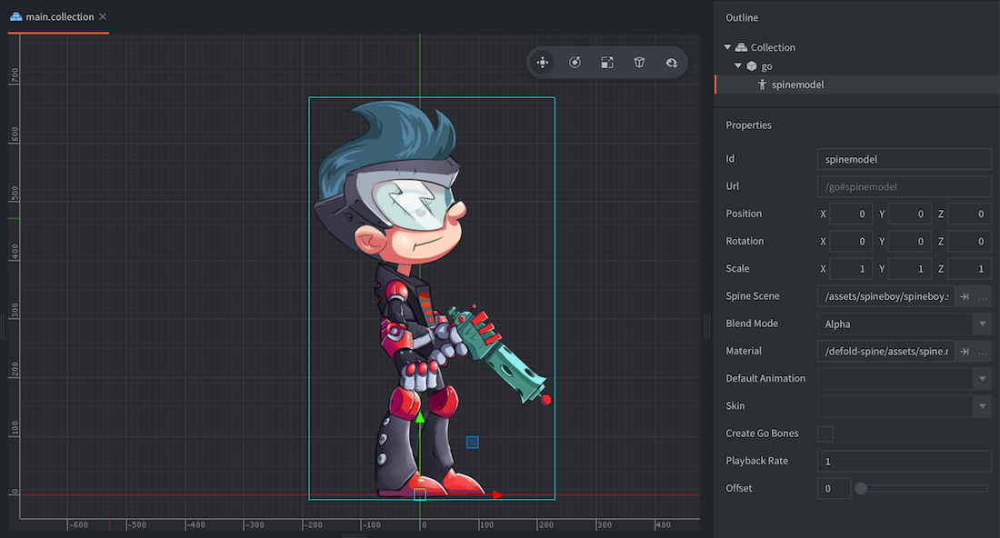


#### Blend modes
:[blend-modes](../shared/blend-modes.md)


### Runtime manipulation
You can manipulate spine models in runtime through a number of different functions and properties (refer to the [API docs for usage](/extension-spine/spine_api/)).


#### Changing properties

A spine model also has a number of different properties that can be manipulated using `go.get()` and `go.set()`:

`animation`
: The current model animation (`hash`) (READ ONLY). You change animation using `spine.play_anim()` (see [Playing Animations](#playing-animations)).

`cursor`
: The normalized animation cursor (`number`).

`material`
: The spine model material (`hash`). You can change this using a material resource property and `go.set()`. Refer to the [API reference for an example](/extension-spine/spine_api/#material).

`playback_rate`
: The animation playback rate (`number`).

`skin`
: The current skin on the component (`hash`).


### Material constants



`tint`
: The color tint of the spine model (`vector4`). The vector4 is used to represent the tint with x, y, z, and w corresponding to the red, green, blue and alpha tint.


### The bone hierarchy

The individual bones in the Spine skeleton are represented internally as game objects. In the *Outline* view of the Spine model component, the full hierarchy is visible. You can see each bone's name and its place in the skeleton hierarchy.

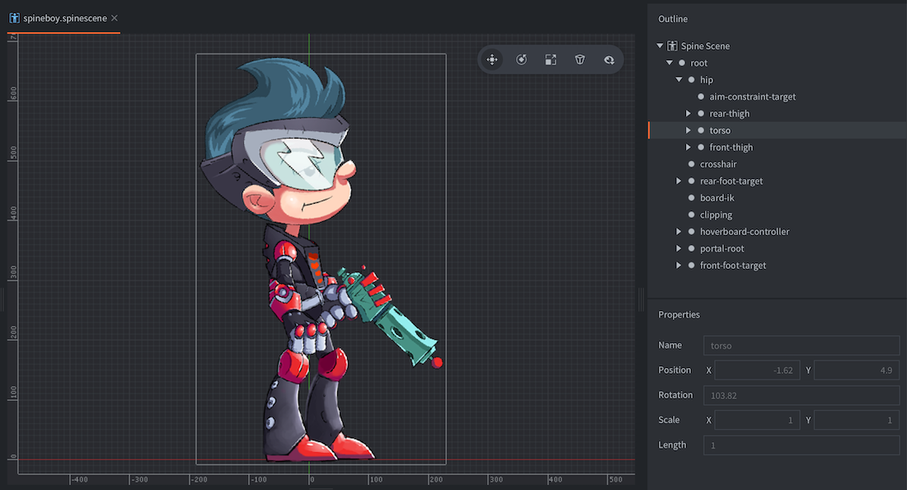

With the bone name at hand, you are able to retrieve the instance id of the bone in runtime. The function [`spine.get_go()`](/extension-spine/spine_api#spine.get_go) returns the id of the specified bone and you can, for instance, child other game objects under the animated game object:

```lua
-- Attach pistol game object to the hand of the heroine
local hand = spine.get_go("heroine#spinemodel", "front_hand")
msg.post("pistol", "set_parent", { parent_id = hand })
```


## Playing animations

To run animations on your model, simply call the [`spine.play_anim()`](/extension-spine/spine_api#spine.play_anim) function:

```lua
local function anim_done(self, message_id, message, sender)
    if message_id == hash("spine_animation_done") then
      -- the animation is done, do something useful...
    end
end

function init(self)
    -- Play the "walk" animation on component "spinemodel" and blend against previous
    -- animation for the first 0.1 seconds, then call callback.
    local anim_props = { blend_duration = 0.1 }
    spine.play_anim("#spinemodel", "run", go.PLAYBACK_LOOP_FORWARD, anim_props, anim_done)
end
```

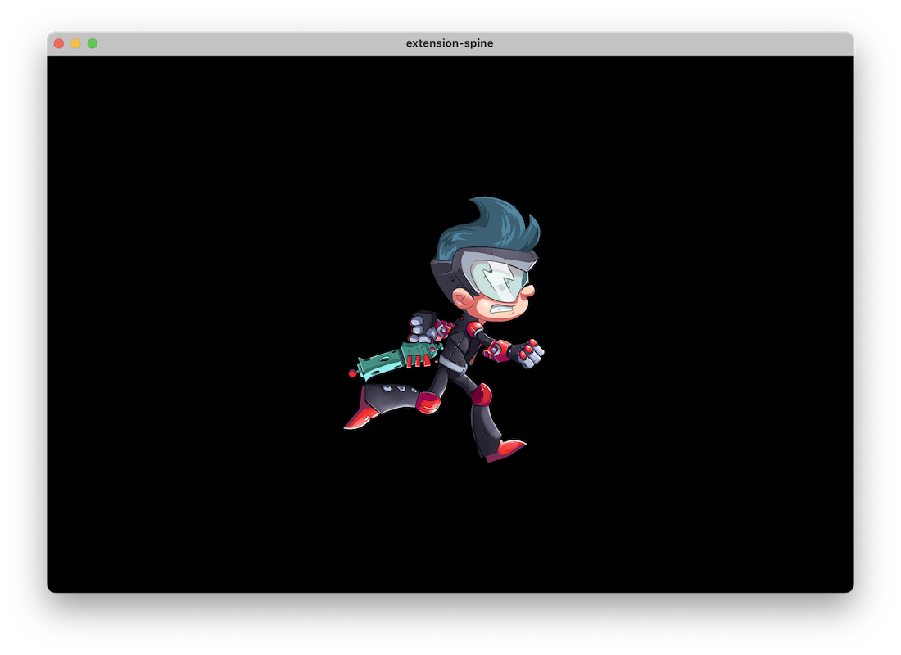

::: sidenote
The callback function will be called when the animation has played to the end. The function is never called for looping animations, nor when an animation is manually canceled via `spine.cancel()`. The callback can be used to trigger events on animation completion or to chain multiple animations together.
:::


### Cursor animation

In addition to using the `spine.play_anim()` to advance a spine animation, *Spine Model* components expose a "cursor" property that can be manipulated with `go.animate()` (more about [property animations](/manuals/property-animation)):

```lua
-- Set the animation on the spine model but don't run it.
spine.play_anim("#spinemodel", "run_right", go.PLAYBACK_NONE, anim_props, cb)

-- Set the cursor to position 0
go.set("#spinemodel", "cursor", 0)

-- Tween the cursor slowly between 0 and 1 pingpong with in-out quad easing.
go.animate("#spinemodel", "cursor", go.PLAYBACK_LOOP_PINGPONG, 1, go.EASING_INOUTQUAD, 6)
```

::: important
When tweening or setting the cursor, timeline events may not fire as expected.
:::


### Timeline events

Spine animations can trigger timed events at precise moments. They are very useful for events that should take place in sync with your animation, like playing footstep sounds, spawning particle effects, attaching or detaching objects to the bone hierarchy or anything else you would like to happen.

Events are added in the Spine software and are visualized on the playback timeline:


Each event is referenced with a name identifier ("bump" in the example above) and each event instance on the timeline can contain additional information:

Integer
: A numerical value expressed as an integer.

Float
: A floating point numerical value.

String
: A string value.

When the animation plays and events are encountered, `spine_event` callbacks are sent back to the callback function provided with `spine.play_anim()`. The message data contains the custom numbers and strings embedded in the event, as well as a few additional fields that are sometimes useful:

`t`
: The number of seconds passed since the first frame of the animation.

`animation_id`
: The animation name, hashed.

`string`
: The provided string value, hashed.

`float`
: The provided floating point numerical value.

`integer`
: The provided integer numerical value.

`event_id`
: The event identifier, hashed.

```lua
local function anim_done(self, message_id, message, sender)
  if message_id == hash("spine_animation_done") then
    if message.animation_id == hash("jump") then
      -- open animation done, chain with "run"
      local properties = { blend_duration = 0.2 }
      spine.play_anim(sender, "run", go.PLAYBACK_LOOP_FORWARD, properties, anim_done)
    end
  elseif message_id == hash("spine_event") then
      pprint("spine event", message)
  end
end
function init(self)
    local url = msg.url("#spinemodel")
    local play_properties = { blend_duration = 0.1 }
    -- first blend during 0.1 sec into the jump, then during 0.2 s into the run animation
    spine.play_anim(url, "open", go.PLAYBACK_ONCE_FORWARD, play_properties, anim_done)
end
```


## Playback Modes

Animations can be played either once or in a loop. How the animation plays is determined by the playback mode:

* go.PLAYBACK_NONE
* go.PLAYBACK_ONCE_FORWARD
* go.PLAYBACK_ONCE_BACKWARD
* go.PLAYBACK_ONCE_PINGPONG
* go.PLAYBACK_LOOP_FORWARD
* go.PLAYBACK_LOOP_BACKWARD
* go.PLAYBACK_LOOP_PINGPONG

The pingpong modes run the animation first forward, then backward.


## Creating Spine GUI nodes

First you have to import the animation data and set up a Spine Scene resource (see above).

Second, the contents of your Spine Scene resource must be available in your GUI scene. Add it by <kbd>right-clicking</kbd> the *Spine Scenes* section of the scene in the *Outline* and select <kbd>Add ▸ Spine Scenes...</kbd>. Choose the Spine Scenes (one or more) you wish to use in the scene.


Third, create a Spine node by <kbd>right clicking</kbd> the *Nodes* section of the *Outline* and selecting <kbd>Add ▸ Spine</kbd>).

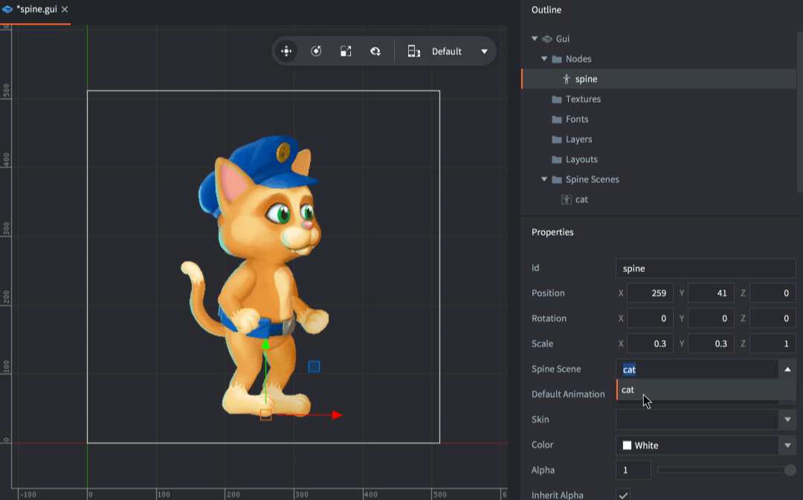

The new node is automatically selected. Make sure to set its properties:

Spine Scene
: The Spine Scene to use as a data source for this node.

Spine Default Animation
: The animation to automatically start playing when the scene is initialized.

Skin
: The skin to use for the animation when the scene is initialized.


### Runtime animation control

Spine nodes can be controlled in runtime through script. To start an animation on a node, simply call the [`gui.play_spine_anim()`](/extension-spine/gui_api/#gui.play_spine_anim:node-animation_id-playback-[play_properties]-[complete_function]) function:

```lua
local catnode = gui.get_node("cat_note")
local play_properties = { blend_time = 0.3, offset = 0, playback_rate = 1 }
gui.play_spine_anim(catnode, hash("run"), gui.PLAYBACK_ONCE_FORWARD, play_properties, function(self, node)
    print("Animation done!")
end)
```

Use one of the following playback modes to control animation playback:

* gui.PLAYBACK_NONE
* gui.PLAYBACK_ONCE_FORWARD
* gui.PLAYBACK_ONCE_BACKWARD
* gui.PLAYBACK_ONCE_PINGPONG
* gui.PLAYBACK_LOOP_FORWARD
* gui.PLAYBACK_LOOP_BACKWARD
* gui.PLAYBACK_LOOP_PINGPONG


### GUI node bone hierarchy

The individual bones in the Spine skeleton can be accessed as GUI nodes. The nodes are named according to their names in the Spine setup.

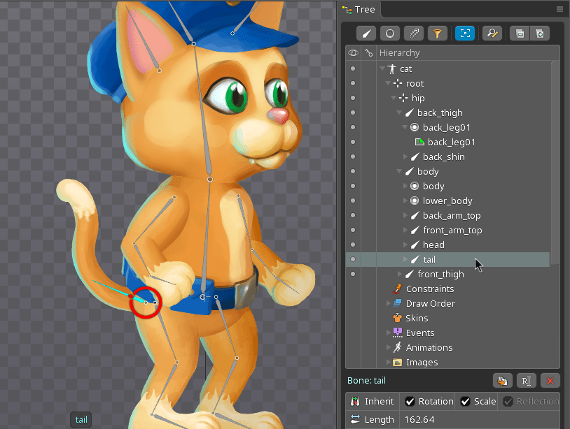

For instance, to attach another node to an existing bone node, fetch the bone node by name with [`gui.get_spine_bone()`](/extension-spine/gui_api#gui.get_spine_bone) and attach the child to it:

```lua
-- Attach a text node to the tail of the cat
local cat = gui.get_node("cat_node")
local textnode = gui.new_text_node(vmath.vector3(400, 0, 0), "Hello tail!")
local tail = gui.get_spine_bone(cat, "tail")
gui.set_parent(textnode, tail)
```

Bones are also accessible through [`gui.get_node()`](/ref/gui#gui.get_node), by the bone name prefixed by the name of the name of the Spine node and a slash (`/`):

```lua
-- Attach a text node to the tail of the cat
local textnode = gui.new_text_node(vmath.vector3(400, 0, 0), "Hello tail!")
local tail = gui.get_node("cat_node/tail")
gui.set_parent(textnode, tail)
```


## Atlas caveats

The animation data references the images used for the bones by name with the file suffix stripped off. You add images to your Spine project in the Spine software and they are listed in the hierarchy under *Images*:

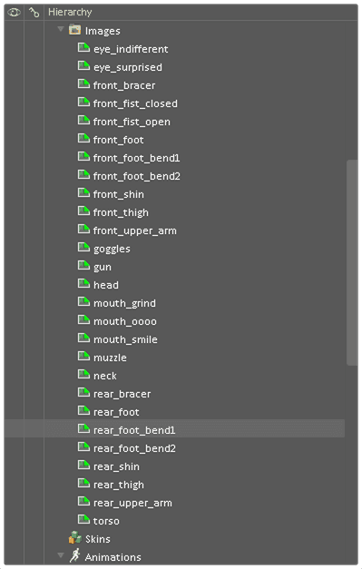

This example shows files laid out in a flat structure. It is, however, possible to organize the files in subfolders and the file references will reflect that. For instance, a file *head_parts/eyes.png* on disk will be referenced as *head_parts/eyes* when you use it in a slot. This is also the name used in the exported JSON file so when creating the Defold image atlas, all names must match an atlas animation.

If you select <kbd>Add Images</kbd> Defold will automatically create animation groups with the same name as the added files, but with the file suffix stripped off. So, after having added the file *eyes.png* its animation group can be referenced by the name "eyes". This works with file names only, not paths.

So what do you do if your animation references "head_parts/eyes"? The easiest way to accomplish a match is to add an animation group (right click the root node in the Atlas *Outline* view and select *Add Animation Group*). You can then name that group "head_parts/eyes" (it's just a name, not a path and `/` characters are legal) and then add the file "eyes.png" to the group.


